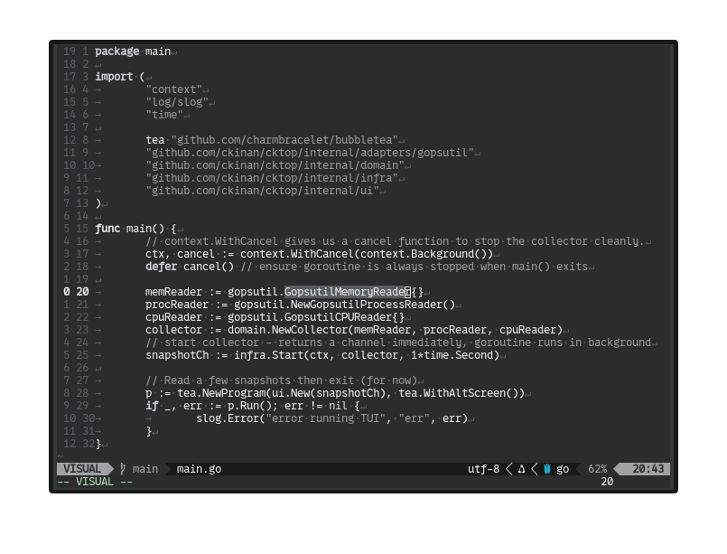

# ckgrayscale.nvim

A dark grayscale colorscheme for Neovim, built with [lush.nvim](https://github.com/rktjmp/lush.nvim).



## Requirements

- Neovim >= 0.9
- [lush.nvim](https://github.com/rktjmp/lush.nvim)

## Installation

Using [lazy.nvim](https://github.com/folke/lazy.nvim):

```lua
{
  "ckinan/ckgrayscale.nvim",
  dependencies = { "rktjmp/lush.nvim" },
  lazy = false,
  priority = 1000,
  config = function()
    vim.opt.background = "dark"
    vim.cmd.colorscheme("ckgrayscale")
  end,
}
```

## Live editing with Lushify

Since the theme is built with lush.nvim, you can edit it with live preview:

1. Open `lua/lush_theme/ckgrayscale.lua`
2. Run `:Lushify`
3. Edit any color value and save -- Neovim re-renders instantly

